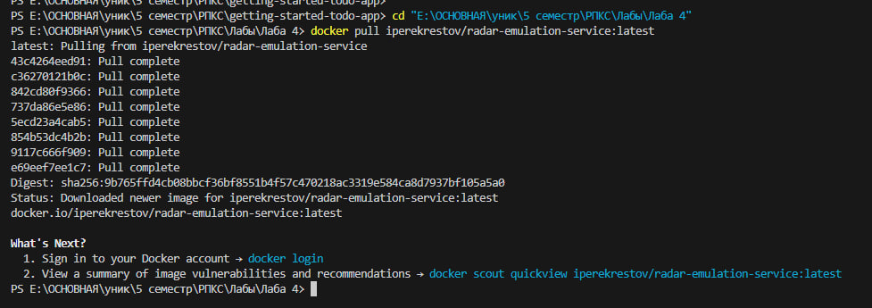
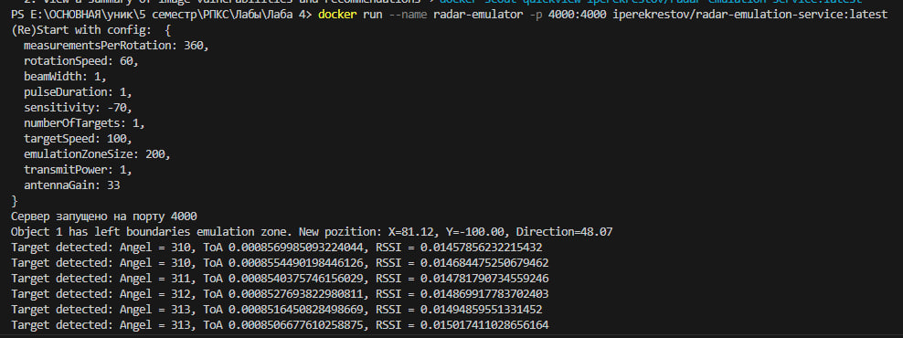
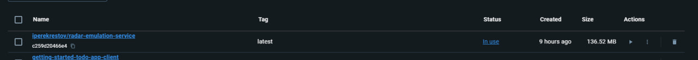
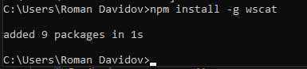
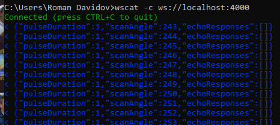
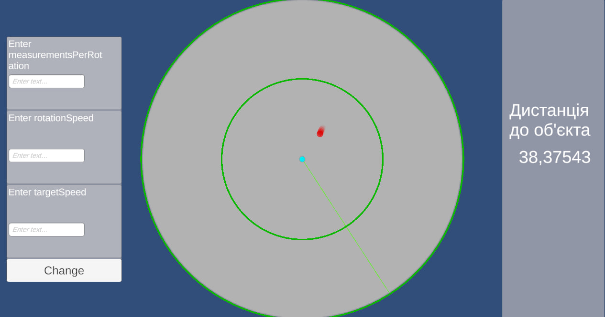
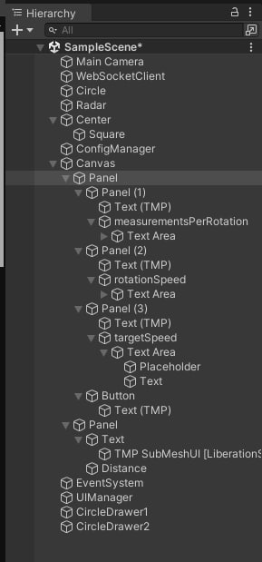
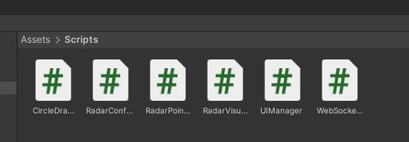
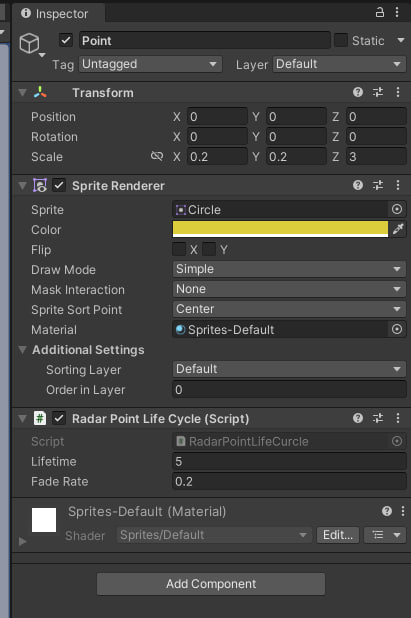
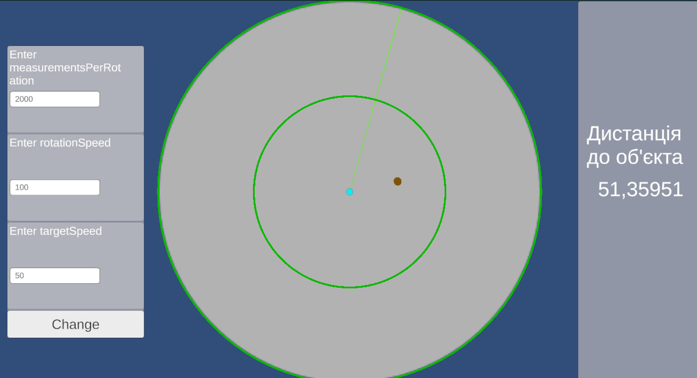

<h2>Лабораторна робота: Візуалізація даних радара з використанням Docker та WebSocket</h2>

<p>Ця лабораторна робота передбачає створення додатку для візуалізації даних радара, що отримуються через WebSocket з використанням Docker. Ми встановимо емульований радарний сервіс, підключимося до нього через WebSocket та відобразимо отримані дані на графіку. Ось покрокова інструкція.</p>

<strong>Крок 1: Встановлення Docker образу</strong>
<p>Спершу переходимо до папки проєкту, після чого виконуємо команду для завантаження емульованої частини радару з Docker Hub:</p>
<pre><code>docker pull iperekrestov/university:radar-emulation-service</code></pre>
<p>На скріншоті нижче видно, як відбувається процес завантаження Docker образу (рис. 1):</p>
<p align="center">
  
</p>

<strong>Крок 2: Запуск контейнера</strong>
<p>Після завантаження Docker образу, ми виконуємо команду для запуску контейнера:</p>
<pre><code>docker run --name radar-emulator -p 4000:4000 iperekrestov/university:radar-emulation-service</code></pre>
<p>Це запускає емуляцію радара на нашій локальній машині, використовуючи порт 4000. Якщо все виконано правильно, у консолі буде відображено повідомлення про успішний запуск контейнера (рис. 2):</p>
<p align="center">
  
</p>

<strong>Крок 3: Підключення та отримання даних</strong>
<p>Після запуску контейнера ми можемо підключитися до радарного сервісу через WebSocket та отримати перші дані. Для цього використовуємо утиліту <code>wscat</code> або будь-який інший WebSocket клієнт:</p>
<pre><code>wscat -c ws://localhost:4000</code></pre>
<p>На наступному скріншоті можна побачити, як виводяться отримані дані з радарного сервісу (рис. 3). Ці дані містять координати цілей, які будуть відображені на графіку:</p>
<p align="center">
  
</p>

<strong>Крок 4: Встановлення необхідних пакетів</strong>
<p>Наступним кроком є встановлення всіх необхідних бібліотек та пакетів для взаємодії з WebSocket та візуалізації даних. У нашому випадку це може бути, наприклад, бібліотека для роботи з графіками, як-от <code>Plotly.js</code> або інша, що дозволяє будувати полярні координати:</p>
<pre><code>npm install plotly</code></pre>
<p>На наступному скріншоті показаний процес встановлення необхідних залежностей для роботи додатку (рис. 4):</p>
<p align="center">
  
</p>

<strong>Крок 5: Запуск WebSocket</strong>
<p>Тепер ми запускаємо підключення до WebSocket сервера, щоб отримати потік даних у реальному часі. Дані з'являються у вигляді JSON-структур, що описують координати виявлених цілей (кут і відстань до об'єктів):</p>
<pre><code>wscat -c ws://localhost:4000</code></pre>
<p>На скріншоті видно, як дані надходять до клієнта (рис. 5), і ми готові використовувати їх для подальшої обробки та візуалізації:</p>
<p align="center">
  
</p>

<strong>Крок 6: Результат виконання</strong>
<p>Нарешті, результатом виконання проєкту є візуалізація цілей на полярному графіку. На основі отриманих даних ми відображаємо кожну ціль як точку на графіку з координатами (кут і відстань). Силу відбитого сигналу можна відобразити за допомогою розміру або кольору точки:</p>
<p>На останньому скріншоті представлено готовий графік, що відображає задетектовані цілі радара (рис. 6):</p>
<p align="center">
  
</p>

<h2>Опис проекту</h2>

<strong>Рисунок 7: Ієрархія об'єктів</strong>
<p>У цій ієрархії представлено основні об'єкти проєкту:</p>
<ul>
  <li><strong>WebSocketClient</strong> (Empty): Об'єкт відповідає за підключення до WebSocket сервера для отримання даних радара.</li>
  <li><strong>Radar</strong> (Empty): На цьому об'єкті знаходиться візуалізатор даних радара.</li>
  <li><strong>ConfigManager</strong> (Empty): Об'єкт для управління конфігурацією радара.</li>
  <li><strong>UIManager</strong> (Empty): Інтерфейс для взаємодії з користувачем, який дозволяє змінювати параметри радара.</li>
  <li><strong>CircleDrawer1 і CircleDrawer2</strong> (Empty): Об'єкти, що відповідають за малювання кіл, які показують радіус дії радара.</li>
  <li><strong>RadarPoint</strong> (Prefab, тип Square): Префаб для відображення цілей на радарі у вигляді точок.</li>
</ul>

<p align="center">
  
</p>
<p align="center">
    Рисунок 7: Ієрархія об'єктів
</p>

<br><br>

<strong>Рисунок 8: Скрипти</strong>
<p>На кожен з об'єктів були додані відповідні скрипти:</p>
<ul>
  <li><strong>WebSocketClient</strong> – цей скрипт підключається до WebSocket сервера, отримує дані про цілі та передає їх для візуалізації.</li>
  <li><strong>RadarVisualizer</strong> – відповідає за обробку та візуалізацію отриманих даних на радарі у вигляді точок.</li>
  <li><strong>RadarConfig</strong> – використовується для налаштування параметрів радара через API (наприклад, кількість вимірювань, швидкість обертання).</li>
  <li><strong>RadarPointLifeCycle</strong> – цей скрипт управляє життєвим циклом точки на радарі: її появою, оновленням та зникненням.</li>
  <li><strong>UIManager</strong> – дозволяє користувачам змінювати параметри радара через інтерфейс.</li>
  <li><strong>CircleDrawer</strong> – відповідає за малювання кіл для позначення меж радіуса дії радара.</li>
</ul>

<p align="center">
  
</p>
<p align="center">
    Рисунок 8: Скрипти
</p>

<br><br>

<strong>Рисунок 9: Префаб точки</strong>
<p>Префаб <strong>RadarPoint</strong> використовується для відображення виявлених радаром цілей у вигляді точок на графіку. На цей префаб додано скрипт <strong>RadarPointLifeCycle</strong>, який керує часом життя кожної точки, її прозорістю та зникненням.</p>

<p align="center">
  
</p>
<p align="center">
    Рисунок 9: Префаб точки
</p>


<h2>Опис скриптів</h2>

<strong>Скрипт CircleDrawer</strong>
<p>Цей скрипт відповідає за малювання кола на сцені, яке використовується для позначення меж радара. За допомогою компонента <code>LineRenderer</code> створюється коло з певним радіусом і кількістю сегментів.</p>

```csharp
using UnityEngine;

public class CircleDrawer : MonoBehaviour
{
    public float radius = 5f;
    public int segments = 100; 
    public float lineWidth = 0.1f; 
    public Color lineColor = Color.white; 

    private LineRenderer lineRenderer;

    void Start()
    {
        lineRenderer = gameObject.GetComponent<LineRenderer>();
        if (lineRenderer == null)
        {
            lineRenderer = gameObject.AddComponent<LineRenderer>();
        }

        lineRenderer.positionCount = segments + 1; 
        lineRenderer.startWidth = lineWidth;
        lineRenderer.endWidth = lineWidth;
        lineRenderer.useWorldSpace = false;
        lineRenderer.loop = true; 
        lineRenderer.material = new Material(Shader.Find("Sprites/Default")); 
        lineRenderer.startColor = lineColor; 
        lineRenderer.endColor = lineColor;  

        DrawCircle();
    }

    void DrawCircle()
    {
        float angleStep = 360f / segments;
        Vector3[] points = new Vector3[segments + 1];

        for (int i = 0; i <= segments; i++)
        {
            float angle = i * angleStep * Mathf.Deg2Rad;
            float x = Mathf.Cos(angle) * radius;
            float y = Mathf.Sin(angle) * radius;
            points[i] = new Vector3(x, y, 0f);
        }

        lineRenderer.SetPositions(points);
    }
}
```

<strong>Скрипт RadarVisualizer</strong>

<p>Цей скрипт відповідає за обробку даних радара та їх візуалізацію. Він приймає дані у вигляді JSON-структури, розміщує точки на екрані відповідно до кута та відстані і обертає радар для відображення поточної інформації.</p>

```csharp
using UnityEngine;
using System.Collections.Generic;
using TMPro;

public class RadarVisualizer : MonoBehaviour
{
    public GameObject pointPrefab;
    public Transform radarCenter;
    public int maxPoints = 5; 
    public float pointLifetime = 5f; 
    public float fadeRate = 0.2f; 
    public float maxRadius = 5f; 
    public float maxDetectionDistance = 200f; 
    public TMP_Text distanceText;

    private List<GameObject> recentPoints = new List<GameObject>();
    private float currentRadarAngle = 0f;

    void Start()
    {
        if (pointPrefab == null || radarCenter == null)
        {
            Debug.LogError("Point Prefab or Radar Center is not assigned.");
        }
    }

    public void ProcessRadarData(string data)
    {
        RadarData radarData = JsonUtility.FromJson<RadarData>(data);
        currentRadarAngle = NormalizeAngle(radarData.scanAngle);

        foreach (var echo in radarData.echoResponses)
        {
            float time = echo.time;
            float distance = (300000f * time) / 2;
            distanceText.text = distance.ToString();

            float scaledDistance = ScaleDistanceToFitCircle(distance);
            float angle = NormalizeAngle(radarData.scanAngle);
            Vector3 position = CalculatePosition(angle, scaledDistance);
            if (ShouldCreatePoint(angle, position))
            {
                CreatePoint(position, echo.power);
            }
        }

        RotateRadar(radarData.scanAngle);
    }

    private float ScaleDistanceToFitCircle(float distance)
    {
        if (distance > maxDetectionDistance)
        {
            return maxRadius;
        }
        else
        {
            return (distance / maxDetectionDistance) * maxRadius;
        }
    }

    private Vector3 CalculatePosition(float angle, float distance)
    {
        float radians = angle * Mathf.Deg2Rad;

        float x = distance * Mathf.Cos(radians);
        float y = distance * Mathf.Sin(radians);
        return new Vector3(x, y, 0);
    }

    private bool ShouldCreatePoint(float angle, Vector3 position)
    {
        float radarAngleInDegrees = NormalizeAngle(currentRadarAngle);
        float pointAngleInDegrees = NormalizeAngle(angle);

        bool isAngleValid = Mathf.Abs(radarAngleInDegrees - pointAngleInDegrees) < 180;
        float distanceFromCenter = position.magnitude;
        bool isPositionValid = distanceFromCenter <= maxRadius;

        return isAngleValid && isPositionValid;
    }

    private float NormalizeAngle(float angle)
    {
        return ((angle % 360) + 360) % 360;
    }

    private void CreatePoint(Vector3 position, float power)
    {
        if (recentPoints.Count >= maxPoints)
        {
            DestroyOldestPoint();
        }

        var point = Instantiate(pointPrefab, radarCenter.position + position, Quaternion.identity);
        var lifeCycle = point.AddComponent<RadarPointLifeCycle>();
        lifeCycle.lifetime = pointLifetime;
        lifeCycle.fadeRate = fadeRate;

        var renderer = point.GetComponent<Renderer>();
        var color = Color.Lerp(Color.green, Color.red, power);
        renderer.material.color = new Color(color.r, color.g, color.b, 1.0f); 
        recentPoints.Add(point);
    }

    private void DestroyOldestPoint()
    {
        if (recentPoints.Count > 0)
        {
            Destroy(recentPoints[0]);
            recentPoints.RemoveAt(0);
        }
    }

    private void RotateRadar(float scanAngle)
    {
        radarCenter.localRotation = Quaternion.Euler(0, 0, -scanAngle);
    }
}

[System.Serializable]
public class RadarData
{
    public float scanAngle;
    public float pulseDuration;
    public EchoResponse[] echoResponses;

    [System.Serializable]
    public class EchoResponse
    {
        public float time;
        public float power;
    }
}
```

<strong>Скрипт RadarPointLifeCycle</strong>

<p>Цей скрипт керує життєвим циклом точок на радарі. Він визначає, скільки часу точка буде відображатися, і поступово зменшує її прозорість, поки не зникне повністю.</p>

```csharp
using UnityEngine;
using System.Collections;

public class RadarPointLifeCycle : MonoBehaviour
{
    public float lifetime = 5f; 
    public float fadeRate = 0.2f; 

    private float alpha = 1.0f;
    private Renderer pointRenderer;

    private void Start()
    {
        pointRenderer = GetComponent<Renderer>();
        if (pointRenderer == null)
        {
            Debug.LogError("Renderer not found on the RadarPoint object.");
            Destroy(this);
            return;
        }

        StartCoroutine(FadeOutAndDestroy());
    }

    private void Update()
    {
        UpdateAlpha();
    }

    private void UpdateAlpha()
    {
        if (pointRenderer != null)
        {
            alpha -= fadeRate * Time.deltaTime; 
            alpha = Mathf.Max(alpha, 0); 

            var color = pointRenderer.material.color;
            color.a = alpha;
            pointRenderer.material.color = color;
        }
    }

    private IEnumerator FadeOutAndDestroy()
    {
        float elapsedTime = 0f;

        while (elapsedTime < lifetime)
        {
            UpdateAlpha(); 
            elapsedTime += Time.deltaTime;
            yield return null;
        }

        Destroy(gameObject);
    }
}
```

<strong>Скрипт WebSocketClient</strong>
<p>Цей скрипт відповідає за встановлення WebSocket-з'єднання з сервером радара. Він отримує повідомлення від сервера у реальному часі, передає ці дані в <code>RadarVisualizer</code> для їх подальшої обробки і відображення.</p>

```csharp
using UnityEngine;
using NativeWebSocket;
using System.Text;

public class WebSocketClient : MonoBehaviour
{
    WebSocket websocket;
    public RadarVisualizer radarVisualizer;

    async void Start()
    {
        websocket = new WebSocket("ws://localhost:4000");

        websocket.OnOpen += () => Debug.Log("WebSocket connection open!");
        websocket.OnMessage += (bytes) =>
        {
            string message = Encoding.UTF8.GetString(bytes);
            Debug.Log("Received message: " + message);
            radarVisualizer.ProcessRadarData(message);
        };

        websocket.OnError += (error) => Debug.LogError("WebSocket Error: " + error);
        websocket.OnClose += (code) => Debug.Log($"WebSocket connection closed with code: {code}");

        await websocket.Connect();
    }

    void Update()
    {
        #if UNITY_EDITOR
        websocket.DispatchMessageQueue();
        #endif
    }

    async void OnApplicationQuit()
    {
        await websocket.Close();
    }
}
```

<strong>Скрипт RadarConfig</strong>

<p>Цей скрипт керує зміною конфігурації радара через HTTP-запити до сервера. Користувач може налаштувати такі параметри, як кількість вимірювань, швидкість обертання та швидкість цілей.</p>

```csharp
using UnityEngine;
using System.Collections;
using System.Collections.Generic;
using UnityEngine.Networking;

public class RadarConfig : MonoBehaviour
{
    private const string configUrl = "http://localhost:4000/config";

    public void UpdateRadarConfig(int measurementsPerRotation, int rotationSpeed, int targetSpeed)
    {
        StartCoroutine(SendConfigUpdate(measurementsPerRotation, rotationSpeed, targetSpeed));
    }

    private IEnumerator SendConfigUpdate(int measurementsPerRotation, int rotationSpeed, int targetSpeed)
    {
        Hashtable config = new Hashtable
        {
            { "measurementsPerRotation", measurementsPerRotation },
            { "rotationSpeed", rotationSpeed },
            { "targetSpeed", targetSpeed }
        };

        string json = JsonUtility.ToJson(new RadarConfigData
        {
            measurementsPerRotation = measurementsPerRotation,
            rotationSpeed = rotationSpeed,
            targetSpeed = targetSpeed
        });

        UnityWebRequest request = UnityWebRequest.Put(configUrl, json);
        request.method = "PUT";
        request.SetRequestHeader("Content-Type", "application/json");
        yield return request.SendWebRequest();

        if (request.result == UnityWebRequest.Result.Success)
        {
            Debug.Log("Radar config updated successfully");
        }
        else
        {
            Debug.LogError("Failed to update radar config: " + request.error);
        }
    }
}

[System.Serializable]
public class RadarConfigData
{
    public int measurementsPerRotation;
    public int rotationSpeed;
    public int targetSpeed;
}
```

<strong>Скрипт UIManager</strong>

<p>Скрипт <code>UIManager</code> забезпечує взаємодію користувача з інтерфейсом для зміни параметрів радара. Він перевіряє правильність введених даних і надсилає запити на зміну конфігурації радара через <code>RadarConfig</code>.</p>

```csharp
using TMPro;
using UnityEngine;
using UnityEngine.UI;

public class UIManager : MonoBehaviour
{
    public TMP_InputField measurementsInput;
    public TMP_InputField rotationSpeedInput;
    public TMP_InputField targetSpeedInput;
    public Button updateButton;
    private RadarConfig radarConfig;

    private void Start()
    {
        radarConfig = FindObjectOfType<RadarConfig>();
        updateButton.onClick.AddListener(OnUpdateButtonClicked);
    }

    private void OnUpdateButtonClicked()
    {
        if (ValidateInputs(out int measurements, out int rotationSpeed, out int targetSpeed))
        {
            radarConfig.UpdateRadarConfig(measurements, rotationSpeed, targetSpeed);
        }
    }

    private bool ValidateInputs(out int measurements, out int rotationSpeed, out int targetSpeed)
    {
        measurements = 0;
        rotationSpeed = 0;
        targetSpeed = 0;

        if (!int.TryParse(measurementsInput.text, out measurements) || measurements <= 0)
        {
            ShowError("Invalid value for measurements per rotation. Please enter a positive integer.");
            return false;
        }

        if (!int.TryParse(rotationSpeedInput.text, out rotationSpeed) || rotationSpeed <= 0)
        {
            ShowError("Invalid value for rotation speed. Please enter a positive integer.");
            return false;
        }

        if (!int.TryParse(targetSpeedInput.text, out targetSpeed) || targetSpeed < 0)
        {
            ShowError("Invalid value for target speed. Please enter a non-negative integer.");
            return false;
        }

        return true;
    }

    private void ShowError(string message)
    {
        Debug.LogError(message);
    }
}
```

<strong>Рисунок 10: Інтерфейс програми з відображенням цілі на радарі</strong>
<p>На цьому зображенні показано інтерфейс програми для управління параметрами радара. Зліва розташовані інпут-поля, де користувач може ввести кількість вимірювань за оберт (<em>measurementsPerRotation</em>), швидкість обертання радара (<em>rotationSpeed</em>) та швидкість руху цілі (<em>targetSpeed</em>). Після введення цих параметрів і натискання на кнопку <strong>Change</strong> дані передаються в систему.</p>

<p>Зміна цих параметрів впливає на поведінку радара: якщо, наприклад, зменшити швидкість обертання, лінія сканування почне рухатися повільніше. Крім того, при зміні швидкості цілі (<em>targetSpeed</em>), точки на радарі з'являються ближче або далі до центру залежно від нових параметрів. На правій частині інтерфейсу відображається актуальна дистанція до об'єкта, яку радара розраховує в реальному часі.</p>

<p align="center">
  
</p>
<p align="center">
    Рисунок 10: Інтерфейс програми з відображенням цілі на радарі
</p>

